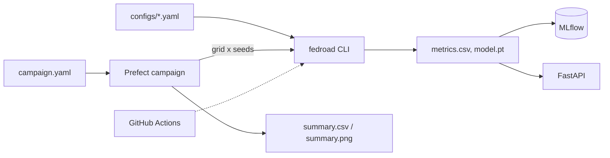

# fedroad


Federated learning simulator for **vehicular networks**, with an MLOps
workflow: typed config, experiment tracking, parameter sweeps, Docker, CI
and an inference API.

Vehicles cross a road section and join a round only if they can train and
upload their model before leaving. Computation and communication costs
(time, energy) are modeled explicitly.

## What is simulated

- **Mobility**: Poisson arrivals, random speeds, fixed road length.
- **Computation**: time `C*n*E/f`, energy `kappa*f^2*C*n*E`.
- **Communication**: Shannon uplink rate, time and energy from model size.
- **Learning**: FedAvg on CIFAR-10, non-IID clients (subset of classes).
- **Dropout**: a client is dropped if it cannot finish before leaving.

## Architecture



Stack: Pydantic (config), Typer (CLI), MLflow (tracking), Prefect
(campaigns), FastAPI (API), Docker Compose, GitHub Actions,
pytest / ruff / mypy / pre-commit.

## Quick start

Python 3.12+, CPU is enough (GPU is used if available).

```bash
python3 -m venv .venv && source .venv/bin/activate
pip install torch torchvision --index-url https://download.pytorch.org/whl/cpu
pip install -e ".[dev,campaign,serve]"

fedroad --out runs/demo --name demo
mlflow ui --backend-store-uri sqlite:///mlflow.db
```

## Campaigns

A campaign runs a grid of configs over several seeds. With the same seed,
all configs see the same traffic and data.

```yaml
# configs/campaign.yaml
name: epochs
base: configs/default.yaml
seeds: [0, 1, 2]
grid:
  n_local_epochs: [1, 3, 5]
```

```bash
fedroad-campaign
```

## Docker and API

```bash
make run        # MLflow server + one simulation
make campaign   # MLflow server + a campaign
make serve      # inference API on http://localhost:8000
make down
```

MLflow UI: `http://localhost:5000`. The API loads `models/model.pt`
(produced by any run) and exposes `/predict`, `/health` and `/docs`.

## Reproducibility and quality

- One `seed` fixes Python, NumPy and PyTorch: same config, same
  `metrics.csv` (tested). Each run stores its config (`cfg.json`).
- CI runs ruff, mypy and pytest (Python 3.12 and 3.13) plus a Docker build.
